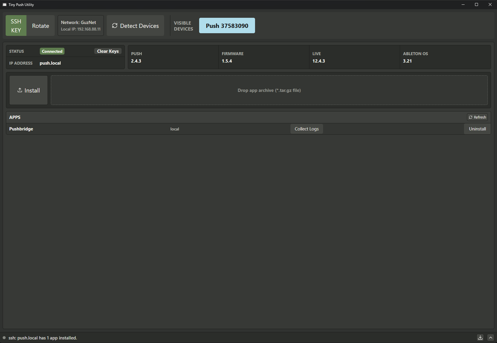

<h1>Tiny Push Utility</h1>



Electron based desktop utility for `Push 3 Standalone` to setup and manage 3rd party apps, primarily `Tiny Sound System` products.

## Disclaimers

> [!CAUTION]
> This project is not supported in any capacity by Ableton. Use at your own risk.

> [!WARNING]
> There are *NO* guarantees regarding safety or security with 3rd party apps installed on Push 3 Standalone.
>
> These apps can potentially do malicious things. Be very careful where you get your packages.
>
> To app developers: It is recommended to provide checksums along side your packages so users can verify if a package was tampered with prior to installation.

> [!NOTE]
> This tool has been built with the help of AI. I am a software developer but have not spent time with web software since college. All code is reviewed and thoroughly tested before release.

- [Disclaimers](#disclaimers)
- [Installation and Use](#installation-and-use)
- [Officially Supported Apps](#officially-supported-apps)
- [FAQ](#faq)
- [Related Projects](#related-projects)
- [App Support and Structure](#app-support-and-structure)
- [Development](#development)
  - [Feature Ideas](#feature-ideas)
  - [Build and Run Locally](#build-and-run-locally)
    - [Install dependencies](#install-dependencies)
    - [Running the App Locally](#running-the-app-locally)

## Installation and Use

Get the [latest version here](https://github.com/JGuzak/Tiny-Push-Utility/releases).

The user manual can be found along side each release.


## Officially Supported Apps

| Name         | Description                                                                |
| ------------ | -------------------------------------------------------------------------- |
<!-- | `Pushbridge` | `Elektron Overbridge` compatible soundcard drivers for `Push 3 Standalone` | -->

## FAQ

**What is this utility for?**

Installing and managing 3rd party apps for `Push 3 Standalone`.

**I don't have Push Standalone but I do have a Push controller, can I still use this tool?**

No, this tool only works with `Push 3 Standalone` devices. `Push 1`, `Push 2`, and `Push 3 controller` are controllers for PC and Mac. This tool is for interacting with the computer inside of `Push 3 Standalone`.

**Can I navigate the file system on Push Standalone from this app?**

Not as of now. This tool is intended to be simple and light weight.

**Are apps installed with this tool safe?**

Not necessarily, be extremely careful when installing 3rd party apps on your `Push`. Make sure you trust the authors of the apps you install.

**What is an SSH key?**

An SSH key is a tool used to securely connect to another computer. `Tiny Push Utility` uses an SSH key to connect to `Push 3 Standalone` to interact with `AbletonOS`.

## Related Projects

- [push-dev](https://github.com/JGuzak/push-dev) by Jordo
- [Ableton Push Hack](https://github.com/federico-pepe/ableton-push-hack) by Fede

## App Support and Structure

This tool is developed and maintained for `Tiny Sound Systems` apps but can be used to install other 3rd party tools as long as the 3rd party developers follow the spec outlined below.

- All payload bits (binaries, scripts, and other dependencies) should be packaged into a `.tar.gz` file.
  - The `.tar.gz` file name must follow this pattern: `<app name>-<version number>.tar.gz`.
- The `.tar.gz` package needs to contain an `install.sh`, `uninstall.sh`, and `collect-logs.sh` script.
- Developers of these app packages are expected to clean up their tools via the uninstall script. In the future, this should be enforced.

*Example:*

```text
package_name-0.0.0.tar.gz
│   install.sh
│   uninstall.sh
│   collect-logs.sh
|   package_name.bin
└───images/sub-folders/etc.
```

## Development

### Feature Ideas

- Verify package checksums prior to installation.
- Add an `Update` option for installed apps
- Open up additional per-app functionality by supporting more than just install, uninstall, and collect-logs options.
  - Separate install/uninstall from activate/deactivate concepts. Allow the user to install things but disable them similar to Norns mods.
    - Concerns about system mutability when activating/deactivating? Install/uninstall should do all mutability operations aside from enable on reboot hooks.
  - Consider any script at the root of the installed package as an operation?
  - Allow interactive scripts and user input during install/uninstall?
  - Per-app config viewing/editing?
- General `Push` device info/log collection?

### Build and Run Locally

If you use `VS Code`, all of the steps below are available via `Tasks`.

The repository pins the host toolchain in `package.json`:

- Node.js `24.18.0`
- npm `11.13.0`

*Windows only:*

Install `Volta` first. It will automatically use the pinned `Node` and `npm` versions when commands are
run from this project directory to avoid muddying your system wide `Node` and `npm` installs.

#### Install dependencies

```powershell
npm run setup
npm run check # Run syntax checks
```

#### Running the App Locally

There are two options for running a local build, one-time build and run or continuous rebuild on source file saves;

```powershell
npm start # Single build/start
npm run dev # Automatic restart on source file save
```
